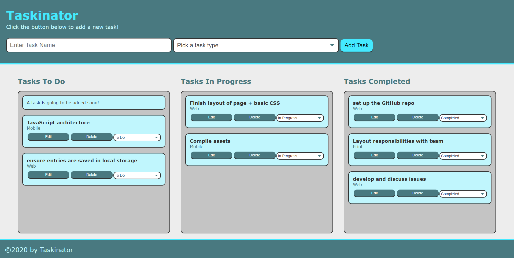

# Taskinator
A digital kanban to display the progress on tasks. Use the To-do/In Progress/Completed collumns to organize and make better use of your time. Each task can be edited & deleted in case of mistakes and errors. Project supports the use of local storage, keep your tasks in check and ready.

# Deployed Image

# Technologies
* HTML5
* CSS3
* JavaScript (ES2015 & ES6)
* Local Storage

# Links
* [Deployed Link](https://alu1868.github.io/Taskinator/)
* [Author Link](https://github.com/alu1868)
